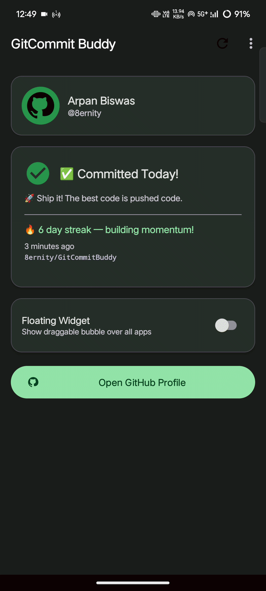
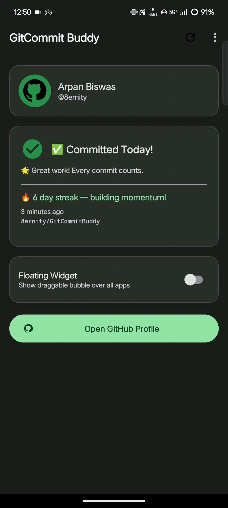
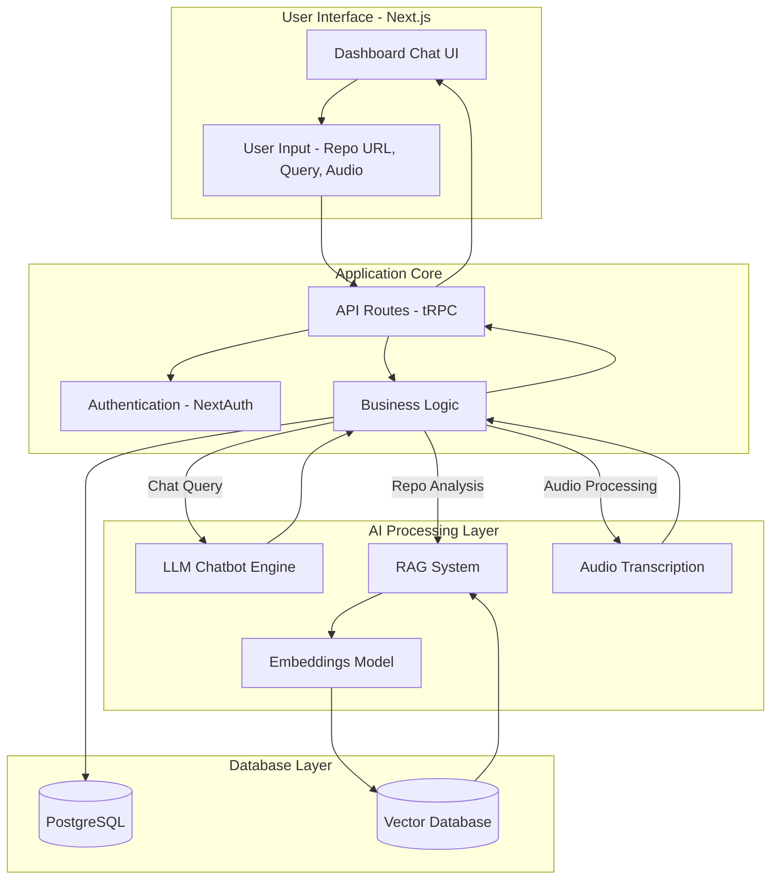

# GitCommit Buddy 🔥

A production-ready Android app that displays a **draggable floating bubble** (chat-head style) reminding you to commit to GitHub every day.

## 🎬 Demo

| Main Interface | Floating Bubble | Settings |
|----------------|----------------|----------|
|  |  |  |


## 📥 Download APK

[Download Latest Release](https://github.com/8ernity/GitCommitBuddy/releases)


## 💡 Why GitCommitBuddy?

Maintaining a daily GitHub streak is hard.

This app solves that by:
- Keeping a floating reminder always visible
- Tracking real commit activity via GitHub API
- Encouraging consistency through smart nudges

Perfect for developers preparing for placements or building habits.

## 📱 Feature Overview

| Feature | Implementation |
|---|---|
| Floating overlay bubble | `WindowManager` + `SYSTEM_ALERT_WINDOW` |
| Draggable + snap-to-edge | Custom `OnTouchListener` with `ValueAnimator` |
| Daily reminders | `WorkManager` `PeriodicWorkRequest` |
| Missed-commit follow-up | `WorkManager` `OneTimeWorkRequest` |
| GitHub API integration | Retrofit 2 + OkHttp |
| Commit streak calc | Event history analysis |
| Offline-first caching | Room database |
| Preferences | Jetpack DataStore |
| MVVM architecture | ViewModel + Repository |
| Dependency injection | Hilt |
| Dark mode | Material 3 DayNight |
| Bubble color picker | 5 color swatches |


## 🏛️ System Architecture



## 🏗️ Project Structure

```
GitCommitBuddy/
├── app/
│   └── src/main/
│       ├── kotlin/com/gitcommitbuddy/
│       │   ├── GitCommitBuddyApp.kt          # Application + Hilt entry point
│       │   ├── data/
│       │   │   ├── api/
│       │   │   │   ├── ApiResult.kt          # Sealed result wrapper
│       │   │   │   ├── GitHubApiService.kt   # Retrofit interface
│       │   │   │   └── GitHubModels.kt       # API data classes
│       │   │   ├── db/
│       │   │   │   └── Database.kt           # Room DB, DAOs, Entities
│       │   │   ├── repository/
│       │   │   │   └── GitHubRepository.kt   # Single source of truth
│       │   │   └── PreferencesManager.kt     # DataStore preferences
│       │   ├── di/
│       │   │   └── AppModule.kt              # Hilt DI module
│       │   ├── service/
│       │   │   ├── FloatingWidgetService.kt  # Overlay bubble service
│       │   │   ├── ReminderWorker.kt         # WorkManager workers
│       │   │   └── BootReceiver.kt           # Boot + notification receivers
│       │   ├── ui/
│       │   │   ├── main/
│       │   │   │   └── MainActivity.kt
│       │   │   └── settings/
│       │   │       └── SettingsActivity.kt
│       │   ├── util/
│       │   │   ├── NotificationHelper.kt     # Channels + builders
│       │   │   ├── PermissionHelper.kt       # Permission checks
│       │   │   ├── TimeFormatter.kt          # ISO-8601 → human readable
│       │   │   └── MotivationalMessages.kt   # Random messages
│       │   └── viewmodel/
│       │       ├── MainViewModel.kt
│       │       └── SettingsViewModel.kt
│       ├── res/
│       │   ├── drawable/                     # Icons + shape backgrounds
│       │   ├── layout/
│       │   │   ├── activity_main.xml
│       │   │   ├── activity_settings.xml
│       │   │   ├── layout_floating_bubble.xml
│       │   │   └── layout_floating_panel.xml
│       │   ├── menu/main_menu.xml
│       │   ├── values/
│       │   │   ├── colors.xml
│       │   │   ├── strings.xml
│       │   │   └── themes.xml
│       │   └── values-night/themes.xml
│       └── AndroidManifest.xml
├── build.gradle
├── settings.gradle
└── gradle.properties
```


<h2 align="left">
  
  &nbsp;<b>Prerequisites</b>
</h2>

| Tool | Version |
|---|---|
| Android Studio | Hedgehog (2023.1.1) or newer |
| JDK | 17 |
| Android SDK | API 34 (target), API 26 (min) |
| Gradle | 8.4 |
| Kotlin | 1.9.22 |


## 🚀 Quick Setup (5 steps)

### Step 1 — Clone / Open the project

1. Open **Android Studio**
2. File → Open → select the `GitCommitBuddy` folder
3. Wait for Gradle sync to complete (~2–3 minutes first time)

### Step 2 — Get a GitHub Personal Access Token

> ⚠️ **TOKEN REQUIRED** — Without a token the app still works but is limited to 60 API calls/hour.  
> With a token: 5,000 calls/hour.

1. Go to **github.com → Settings → Developer settings**
2. **Personal access tokens → Fine-grained tokens → Generate new token**
3. Set expiry (e.g. 1 year)
4. Under **Repository access**: `Public Repositories (read-only)`
5. Under **Permissions → Account permissions**:
   - `Events`: **Read-only**
6. Click **Generate token**
7. **Copy the token** — you won't see it again!

### Step 3 — Run the app

1. Connect a physical Android device (API 26+) **or** start an emulator
2. Click **Run ▶** (or `Shift+F10`)
3. The app installs and opens

### Step 4 — Configure credentials

1. Tap **Open Settings** on the main screen (or the ⋮ menu → Settings)
2. Enter your **GitHub username** (e.g. `octocat`)
3. Paste your **Personal Access Token**
4. Tap **Save Credentials**

### Step 5 — Enable the floating widget

1. Back on the main screen, toggle **Floating Widget** ON
2. A system dialog appears — tap **Allow** to grant overlay permission
3. The green bubble appears over all your apps! 🟢


## 🔐 Where Is My Token Stored?

Your PAT is stored **only on your device** using Jetpack DataStore (encrypted Android storage). It is:
- ❌ Never sent anywhere except `api.github.com`
- ❌ Never logged
- ❌ Never backed up to cloud
- ✅ Transmitted over HTTPS only


## 🧪 Testing the App

### Test notifications immediately
```kotlin
// In Android Studio's Terminal:
adb shell am broadcast -a com.gitcommitbuddy.OPEN_GITHUB
```

### Trigger WorkManager immediately (debug)
Open **App Inspection** in Android Studio → **Background Task Inspector** → select `daily_reminder` → click **Run Now**

### Check overlay permission manually
```
Settings → Apps → GitCommit Buddy → Display over other apps → Allow
```


## 🏛️ Architecture Deep Dive

```
UI Layer          ViewModel Layer       Data Layer
─────────         ───────────────       ──────────
MainActivity  ←→  MainViewModel    ←→  GitHubRepository
Settings      ←→  SettingsViewModel     ├── GitHubApiService (Retrofit)
FloatingWidget    (StateFlow/LiveData)  ├── CommitCacheDao (Room)
                                        └── PreferencesManager (DataStore)
```

**Data flow:**
1. UI calls `viewModel.refresh()`
2. ViewModel calls `repository.refreshCommitStatus()`
3. Repository hits GitHub API via Retrofit
4. Response is parsed → `CommitStatus` domain object
5. Results saved to Room cache
6. Room emits via `Flow` → ViewModel → UI updates


## 📋 Permissions Explained

| Permission | Why needed |
|---|---|
| `SYSTEM_ALERT_WINDOW` | Draw the floating bubble over other apps |
| `INTERNET` | Fetch GitHub commit data |
| `POST_NOTIFICATIONS` | Daily reminder notifications (Android 13+) |
| `FOREGROUND_SERVICE` | Keep the floating widget service alive |
| `VIBRATE` | Haptic feedback on reminders |
| `RECEIVE_BOOT_COMPLETED` | Reschedule WorkManager after reboot |
| `REQUEST_IGNORE_BATTERY_OPTIMIZATIONS` | Ensure reliable background work |
| `SCHEDULE_EXACT_ALARM` | Precise reminder timing (Android 12+) |


## 🔧 Customisation

### Change default reminder time
In `ReminderWorker.kt`, change the default in `scheduleDailyReminder()`:
```kotlin
// Default: 9 PM (hour=21, minute=0)
ReminderWorker.scheduleDailyReminder(context, reminderHour = 21, reminderMinute = 0)
```

### Add new bubble colors
In `SettingsActivity.kt`, add a new swatch:
```kotlin
binding.colorTeal.setOnClickListener { selectColor("#00796B") }
```

### Extend GitHub data (PRs, issues, etc.)
In `GitHubRepository.kt`, filter for additional event types:
```kotlin
val prEvents = events.filter { it.type == "PullRequestEvent" }
```


## 🐛 Common Issues

| Problem | Solution |
|---|---|
| Bubble doesn't appear | Grant overlay permission: Settings → Apps → GitCommit Buddy → Display over other apps |
| "User not found" error | Double-check username spelling (case-sensitive) |
| "Invalid token" error | Token may have expired — generate a new one |
| No notifications | Check notification permission + battery optimisation exemption |
| App crashes on launch | Ensure minSdk 26+ device/emulator |
| WorkManager not firing | Disable battery optimisation for the app |
| Gradle sync fails | File → Invalidate Caches → Restart |


## 📦 Key Dependencies

```gradle
// UI
com.google.android.material:material:1.11.0       // Material 3
androidx.constraintlayout:constraintlayout:2.1.4

// Architecture
androidx.lifecycle:lifecycle-viewmodel-ktx:2.7.0
androidx.lifecycle:lifecycle-livedata-ktx:2.7.0

// Background work
androidx.work:work-runtime-ktx:2.9.0              // WorkManager

// Networking
com.squareup.retrofit2:retrofit:2.9.0
com.squareup.okhttp3:logging-interceptor:4.12.0

// Local storage
androidx.room:room-runtime:2.6.1                  // SQLite ORM
androidx.datastore:datastore-preferences:1.0.0    // Key-value prefs

// DI
com.google.dagger:hilt-android:2.50               // Hilt

// Image loading
com.github.bumptech.glide:glide:4.16.0
```


## 🚀 Building a Release APK

1. Generate a keystore:
```bash
keytool -genkey -v -keystore gcb-release.jks \
  -alias gcb -keyalg RSA -keysize 2048 -validity 10000
```

2. Add to `app/build.gradle`:
```gradle
android {
    signingConfigs {
        release {
            storeFile file('../gcb-release.jks')
            storePassword 'YOUR_STORE_PASSWORD'
            keyAlias 'gcb'
            keyPassword 'YOUR_KEY_PASSWORD'
        }
    }
    buildTypes {
        release { signingConfig signingConfigs.release }
    }
}
```

3. Build:
```
Build → Generate Signed Bundle/APK → APK → release
```


## 📝 License

MIT License — free to use, modify, and distribute.

---

*Built with ❤️ and Kotlin. Happy committing! 🔥*
